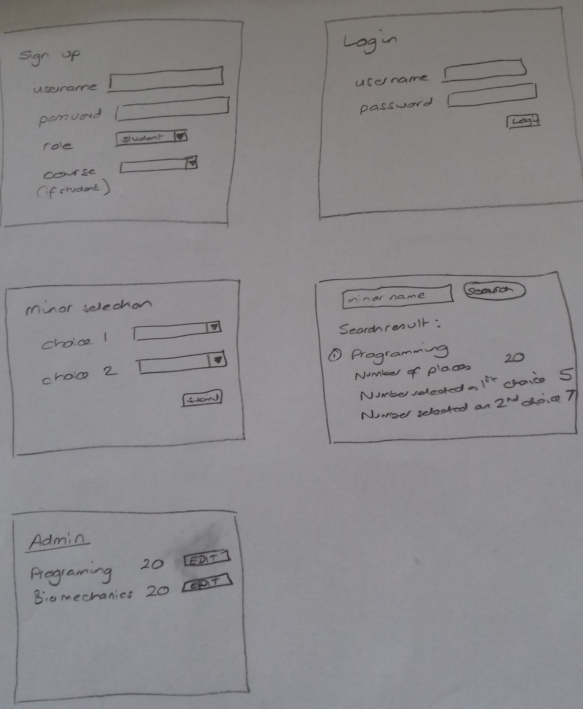

#### COMP0034 Deferred assessment

_Skeleton code for the deferred assessment activity_

To get started:

1. Create a project in PyCharm (or other IDE)

Fork this GitHub repository: https://github.com/UCLComputerScience/comp0034-deferredassessment.git, this will create a copy in your own GitHub account. You do not have to use this code, however it may help to give you a structure from which to start. To use it from within PyCharm, select “Check out from version control” then “Git” and complete the prompt with the URL to the repository in your GitHub (e.g. https://github/yourgithubname/comp00340-deferredassessment.git) and press Clone.

Create a virtual environment (venv). 

Install the requirements for the project.

Check that the Flask app works. You should be able to run the Flask app and view it in a browser at http://127.0.0.1:5000/

3. Read the requirements and decide on the features to implement.

It might help to clarify your ideas if you roughly sketch the screen flow of the app. For example,  a basic set of screens for the app could be as follows:

 
4. Code one requirement
 
Don’t overwhelm yourself. Start with one requirement, code that and then start another.

For example, create the sign up form and test that you can submit this to the database. Once you can do this then look at the other requirements.

Note: Implementing Flask-Login to track whether a person is logged in or not may be complex. You may want to leave requirement 7 which requires this to later in the project and instead start by creating the features in a way that everyone can use them. This way if you are unable to implement sessions you will still have features of the web app that you can demonstrate.

5. Code at least some tests

