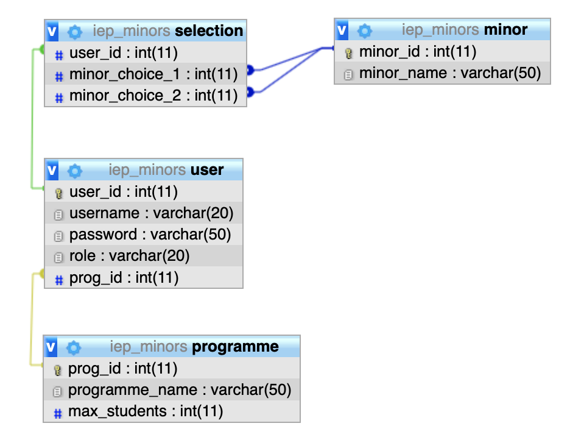

#### COMP0034 Deferred assessment

_Skeleton code for the deferred assessment activity_

To get started:

1. Create a project in PhpStorm (or other IDE)

As a starting point you can clone the GitHub repository: https://github.com/UCLComputerScience/comp0034-deferredassessment.git 

You do not have to use this code, however it may help to give you a structure from which to start. To use it from within PhpStorm, select “Check out from version control” then “Git” and complete the prompt with the URL above and press Clone, e.g.
 
You will need to edit the database credentials in the file php/dbcreds.php. The database name, username and password should work, however the port may not. If you are using WAMP this is probably 3306 and not 8889.

2. Create a database using PHPMyAdmin

A .sql file with a database structure and some sample data is provided. This can be found on Moodle, and in this GitHub repository.

You can add any fake/dummy data you need for your application e.g. make up student or administrator details, make up any additional data about the courses etc.

Use the import function in PHPMyAdmin to create the database using the iep_minors.sql file. This also contains SQL code to create a user to access the datanase. The details for this user are also in the dbcreds.php file.

You may need to change the port number in [the php/dbcreds.php file](php/dbcreds.php)

The structure of the database is as follows:

3. Read the requirements and decide on the features to implement.

It might help to clarify your ideas if you roughly sketch the screen flow of the app. For example,  a basic set of screens for the app could be as follows:

 
4. Code one requirement
 
Don’t overwhelm yourself. Start with one requirement, code that and then start another.

For example, create the sign up form and test that you can submit this to the database. Once you can do this then look at the other requirements.

Note: Implementing sessions to track whether a person is logged in or not may be complex. You may want to leave this to later in the project and instead start by creating the features in a way that everyone can use them. This way if you are unable to implement sessions you will still have features of the web app that you can demonstrate.
